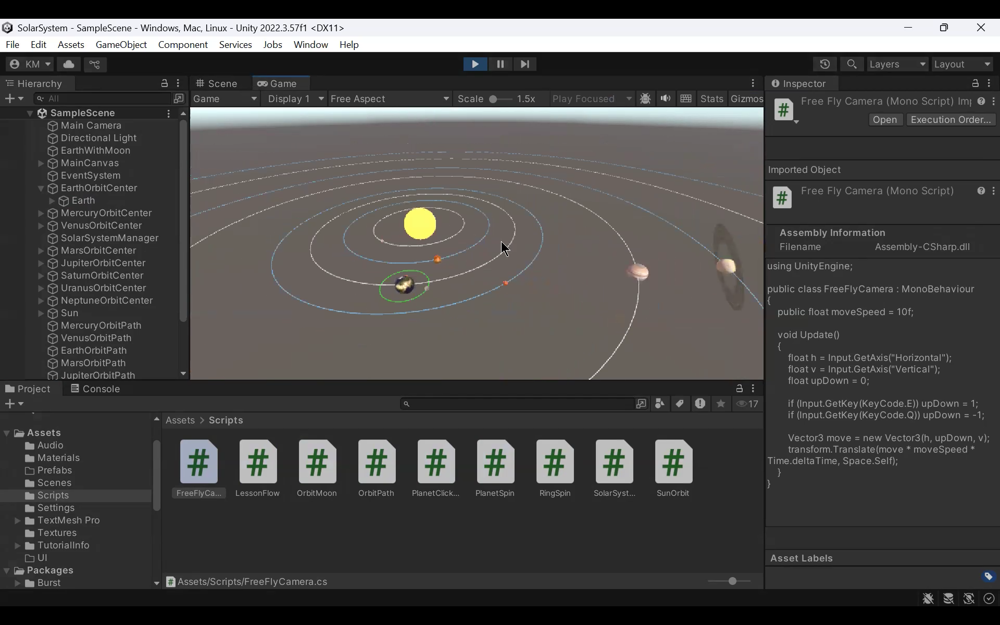

# Solar System Explorer

Interactive 3D Solar System visualization built with Unity and Blender.  
The project simulates planetary motion and demonstrates the integration of 3D modeling, scripting, and interactive environments.

## Features
- 3D solar system environment
- Planet rotation and orbit simulation
- Custom planetary textures
- Spatial audio effects
- Interactive camera exploration
- Blender models imported into Unity

## Technologies
- Unity
- Blender
- C#
- Spatial audio design

## Preview

## Project Structure
Assets/
    Models/
    Textures/
    Scripts/

Packages/
ProjectSettings/

Only essential Unity folders are included. The Library folder is excluded because Unity regenerates it automatically.

## Running the Project
1. Clone the repository  
2. Open the project using Unity Hub  
3. Unity will rebuild required project files automatically

## Learning Objectives
This project demonstrates:
- 3D scene design
- Unity object hierarchies
- scripting interactive behavior
- integration of Blender assets into Unity
- spatial visualization techniques

## Future Improvements
- Planet information panels
- Camera-follow functionality
- Additional celestial bodies
- Enhanced orbital physics
